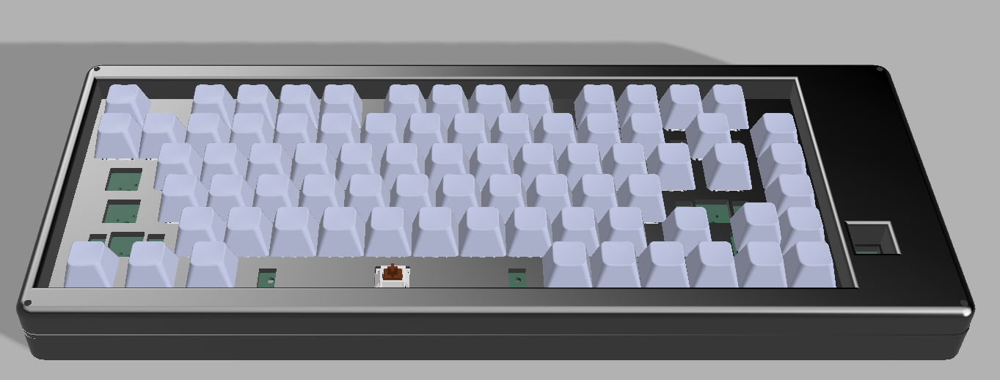
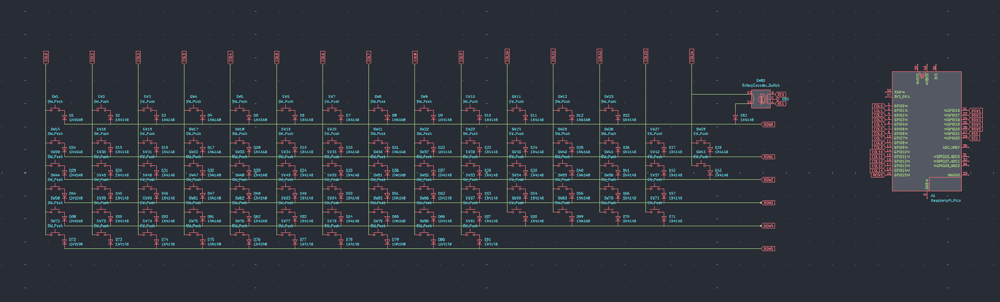
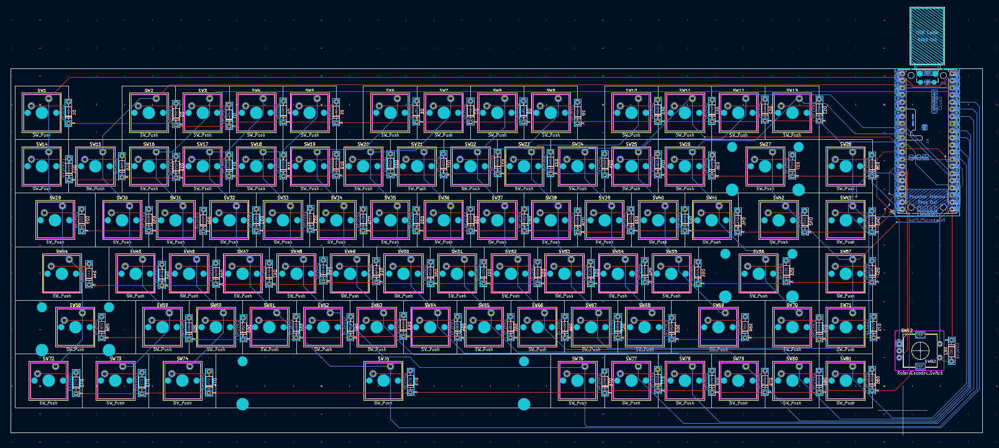
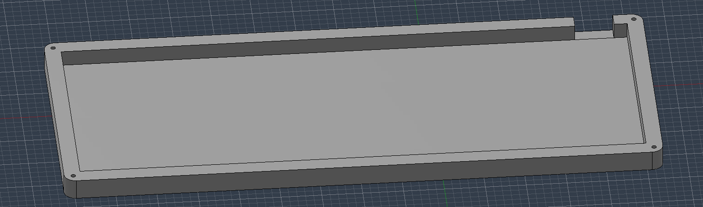
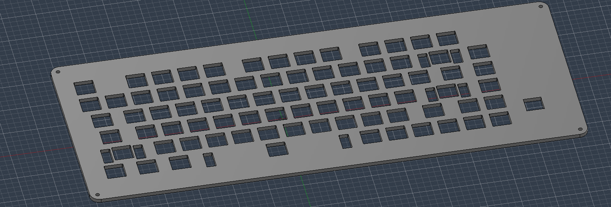
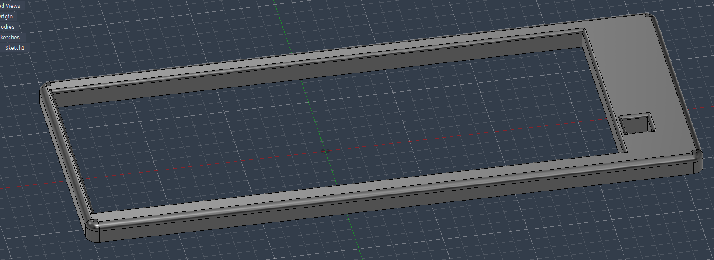

# Chaney-Board

### Schematic

### PCB 

### Case

### 3D view of all parts together 

## BOM

|Item           |Price|Link            |
|---------------|-----|----------------|
|PCB            |100  |pcbpower.com    |
|Keycaps        |25   |[curiositycaps.in](https://curiositycaps.in/products/black-carbon-fiber-texture-top-translucent-keycaps?_pos=4&_sid=48b5e19de&_ss=r)|
|Key switches   |18   |[meckeys.com](https://meckeys.com/shop/accessories/keyboard-accessories/key-switches/gateron-low-profile-2-0-mechanical-switch-3pin/)     |
|Diodes         |2    |[amazon.in](https://www.amazon.in/s?k=1N4148&crid=3D3M061C027VS&sprefix=1n414%2Caps%2C428&ref=nb_sb_noss_2)         |
|Pico |4.12  |[robu.in](https://robu.in/product/raspberry-pi-pico/)  | 
|Stablizers| 0 |Self-sourced|
|Case|0|Print legion|
|screws & headinserts| 0| Self-sourced|
|Total          |150 |                |

